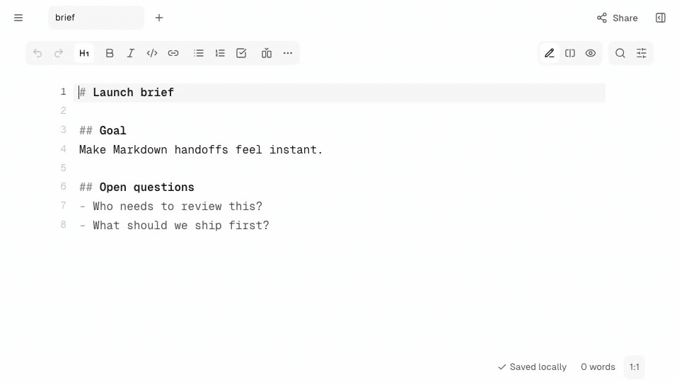

<h1 align="center">Tabula.md</h1>

<p align="center">
  Local-first Markdown workspace for people and coding agents.
  <br />
  Keep Markdown as the handoff format.
</p>

<p align="center"><a href="https://tabula.md">Open Tabula.md</a></p>

<p align="center">
  <a href="https://tabula.md" target="_blank" rel="noopener">
    
  </a>
</p>

## About

The hosted app at [tabula.md](https://tabula.md) is the reference Tabula.md
experience. Tabula.md is currently in public preview.

The app is intentionally Markdown-file-first. It does not turn your workspace
into a database or proprietary document format. Markdown remains the source of
truth for handoff to teammates, repositories, and coding agents.

## Features

- Local-first Markdown workspaces.
- GitHub Flavored Markdown editing and preview.
- Files, outline, and product comments next to the editor.
- Dark, light, and system themes.
- Browser autosave and local restore.
- Encrypted live collaboration by room link.
- Encrypted Snapshot links for import and handoff.

## Run Locally

Install dependencies:

```sh
npm install
```

Start the app:

```sh
npm run dev
```

Open `http://localhost:5173`.

The app runs locally without hosted services. Configure a room server or
snapshot store only when you need live sessions or Snapshot links during local
development.

## Related Repositories

- [`tabula-room`](https://github.com/tabula-md/tabula-room): encrypted live
  collaboration relay.
- [`tabula-json`](https://github.com/tabula-md/tabula-json): encrypted Snapshot
  blob store.

## Backed By

Tabula.md is backed by
[Marker Inc Korea](https://github.com/Marker-Inc-Korea).

## License

MIT. See `LICENSE`.
