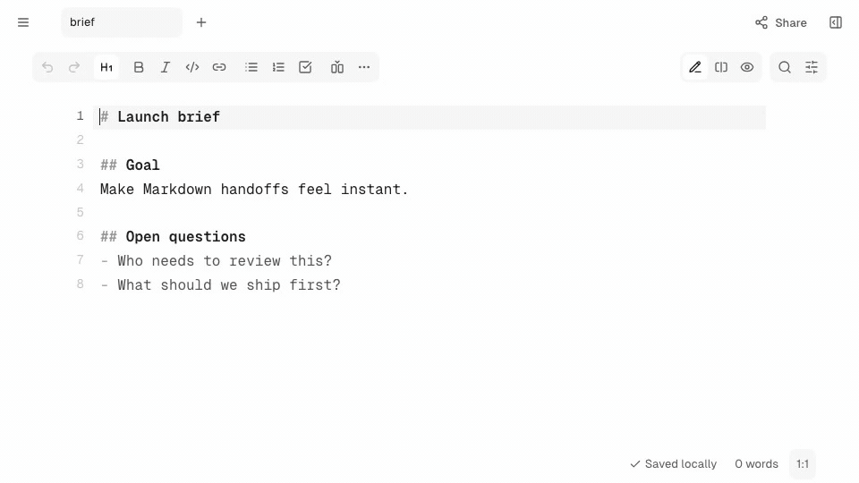

<p align="center">
  <a href="https://tabula.md">
    
  </a>
</p>

<h1 align="center">Tabula</h1>

<p align="center">
  <strong>Real-time collaboration for Markdown knowledge bases and LLM wikis.</strong>
  <br />
  Open an existing workspace, edit the same files with people and AI agents,
  and export portable Markdown when the work is done.
</p>

<p align="center"><a href="https://tabula.md">Open Tabula</a></p>

<p align="center">
  <a href="https://tabula.md" target="_blank" rel="noopener">
    
  </a>
</p>

## Why Tabula

AI agents can create and maintain specifications, runbooks, codebase wikis,
and other knowledge across many linked Markdown files.

When another person needs to review or correct that work, moving the files into
another document platform disconnects them from their Markdown structure. A
pull request or file attachment turns the work into a sequence of snapshots.

Tabula opens the existing folder as an encrypted, real-time workspace.

- Import a Markdown knowledge base without signing up.
- Invite people with one encrypted room link.
- Let AI agents work in the same files through MCP.
- Navigate links, backlinks, Wikilinks, and embedded documents.
- Search content and frontmatter metadata.
- Review compatibility and maintenance issues before export.
- Return the workspace as portable Markdown files.

Tabula is in public preview. The hosted app at
[tabula.md](https://tabula.md) is the reference deployment.

Opening a folder creates a working copy in the browser. Tabula does not modify
or continuously synchronize with the original local folder. Export a document
or workspace when you want the files back on disk.

## Knowledge workspace support

Tabula works with ordinary Markdown folders and linked Markdown wikis. It also
recognizes conventions used by OKF-compatible and OpenWiki workspaces.

- Markdown links, heading fragments, Wikilinks, aliases, and embeds
- Outgoing links, backlinks, broken links, and ambiguous targets
- Full-text and metadata-aware search
- Type, tags, status, trust, freshness, ownership, and sources
- Human verification metadata
- OKF compatibility checks
- Index and `log.md` suggestions
- Review before workspace export

Tabula recognizes Obsidian-style linking conventions but does not claim to
preserve every Obsidian plugin or `.obsidian` configuration. Unknown
frontmatter fields are preserved instead of being discarded.

## Collaborate with people and AI agents

Create a live session and share the complete room URL with the people who need
to participate. Everyone in the room can edit the same files, leave comments,
and see updates in real time.

Codex, Claude, and other MCP-capable agents can join the same workspace.

For agent-guided setup, paste this into a shell-capable agent:

```text
Set up Tabula MCP for this client by following every step at:
https://tabula.md/agent-install.txt
```

Or configure a supported client directly.

Connect Codex:

```sh
codex mcp add tabula -- npx -y @tabula-md/mcp@latest
```

Connect Claude Code:

```sh
claude mcp add tabula -- npx -y @tabula-md/mcp@latest
```

After connecting, create a live session and give the agent the complete room
URL with a concrete task.

The room URL is a bearer secret. Anyone with it can join and decrypt the
session, so do not put it in logs, public issues, or public messages.

See [Tabula MCP](https://github.com/tabula-md/tabula-mcp) for Claude Desktop,
other MCP clients, and self-hosting.

## Features

- Source, Visual, Split, and Preview editing modes
- Files, Outline, Links, Comments, Search, and Knowledge panels
- GitHub Flavored Markdown
- Browser autosave and local restore
- Encrypted real-time collaboration
- Encrypted export links
- Document and workspace export
- Dark, light, and system themes

## Run locally

Install dependencies and start the development server:

```sh
npm install
npm run dev
```

Open [http://localhost:5173](http://localhost:5173).

Local editing works without any hosted service. Live collaboration and export
links require their respective optional services.

To connect the app to a local room server running on port `3002`:

```sh
VITE_TABULA_ROOM_URL=http://localhost:3002 npm run dev
```

## Test and build

```sh
npm test
npm run build
npm run test:browser
```

Focused browser suites are available when changing a specific surface:

```sh
npm run test:browser:workspace
npm run test:browser:editor
npm run test:browser:layout
npm run test:browser:panels
npm run test:browser:collab
```

See [Development](DEVELOPMENT.md) for the complete development and validation
workflow.

## Repository structure

| Path | Role |
| --- | --- |
| `tabula-app` | React and Vite application, editor, preview, panels, persistence, and collaboration client |
| `packages/tabula` | Reusable Markdown workspace, knowledge index, and collaboration primitives |
| `scripts` | Repository checks, browser smoke suites, and development utilities |
| `docs` | Product, architecture, collaboration, and self-hosting documentation |

## Related repositories

| Repository | Role |
| --- | --- |
| [`tabula-mcp`](https://github.com/tabula-md/tabula-mcp) | Connects Codex, Claude, and other MCP clients to live Tabula workspaces |
| [`tabula-room`](https://github.com/tabula-md/tabula-room) | Encrypted real-time relay for live sessions |
| [`tabula-json`](https://github.com/tabula-md/tabula-json) | Encrypted snapshot storage for export links |

## Project

- [Documentation](docs/README.md)
- [Live collaboration](docs/live-collaboration.md)
- [Export links](docs/shareable-links.md)
- [Self-hosting](docs/self-hosting.md)
- [Contributing](CONTRIBUTING.md)
- [Security](SECURITY.md)
- [Privacy](PRIVACY.md)

## Backed by

Tabula is backed by
[Marker Inc Korea](https://github.com/Marker-Inc-Korea).

## License

MIT. See `LICENSE`.
