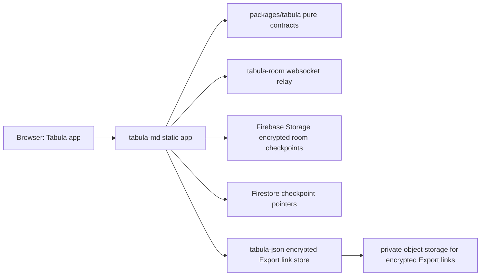

# Self-Hosting Tabula.md

Tabula.md is a static app plus optional service backends. The app keeps
Markdown plaintext and encryption keys in the browser. Services receive routing
metadata and ciphertext only.



## Local App

Install and run this repository:

```sh
npm install
npm run dev
```

Open `http://localhost:5173`.

## Live Collaboration

Run the room server in a sibling checkout:

```sh
git clone https://github.com/tabula-md/tabula-room.git ../tabula-room
cd ../tabula-room
npm install
npm run dev
```

Then run the Tabula app with the room URL:

```sh
VITE_TABULA_ROOM_URL=http://localhost:3002 npm run dev
```

Live collaboration links use:

```txt
https://your-app.example/#room=<roomId>,<roomKey>
```

The room server is relay-only. It should never receive `roomKey`, plaintext
Markdown, decrypted binary room packets, or room checkpoints.

For live rooms that should survive reloads, late joins, or all peers
temporarily leaving, configure Firebase live room persistence:

```sh
VITE_TABULA_ROOM_URL=http://localhost:3002 \
VITE_TABULA_FIREBASE_CONFIG='{"apiKey":"...","authDomain":"...","projectId":"...","appId":"..."}' \
npm run dev
```

The browser encrypts the Yjs checkpoint with the fragment `roomKey`. Firebase
Storage receives the ciphertext blob; Firestore receives only a public-room
generation pointer, blob path, byte length, timestamps, and expiry. Neither may
receive the fragment, key, plaintext, decrypted updates, or local paths.
Configure Firestore TTL for `expiresAt` and a Storage lifecycle rule for stale
`roomCheckpoints/` objects. Without Firebase, a new peer needs another active
peer to provide room state.

## Export Links

Run the JSON Export link store in a sibling checkout:

```sh
git clone https://github.com/tabula-md/tabula-json.git ../tabula-json
cd ../tabula-json
npm install
npm run dev
```

Then run the Tabula app with the JSON URL:

```sh
VITE_TABULA_JSON_URL=http://localhost:3004 npm run dev
```

Export links use:

```txt
https://your-app.example/#json=<snapshotId>,<snapshotKey>
```

The JSON service stores encrypted Export link blobs. It should never receive
`jsonKey`, `roomKey`, URL fragments, live room checkpoints, or plaintext
Markdown.

For production, run `tabula-json` as a Node service with a private storage
backend. The bucket or volume should not be public; the `tabula-json` HTTP API
is the read/write boundary.

## Production Build

Build the static app:

```sh
VITE_TABULA_ROOM_URL=https://rooms.example.com \
VITE_TABULA_FIREBASE_CONFIG='{"apiKey":"...","authDomain":"...","projectId":"...","appId":"..."}' \
VITE_TABULA_JSON_URL=https://json.example.com \
npm run build
```

Serve `dist` from a static host. Configure the room and JSON services with:

- TLS.
- Allowed origins for the app domain.
- Payload limits.
- Rate limits.
- Firebase Storage for encrypted room checkpoints and Firestore for pointers.
- Private storage for encrypted Export link blobs.
- Logs that exclude URL fragments, keys, and plaintext Markdown.

If `VITE_TABULA_ROOM_URL` or `VITE_TABULA_JSON_URL` is missing, the matching
Share action remains unavailable instead of falling back to localhost.
